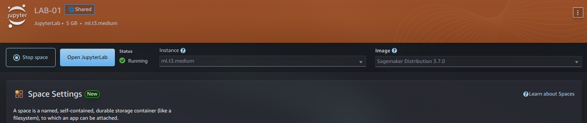
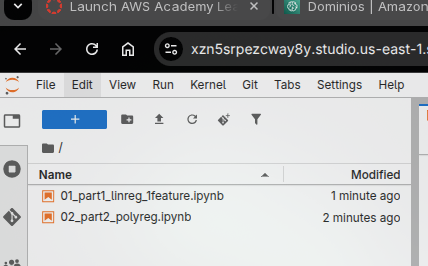
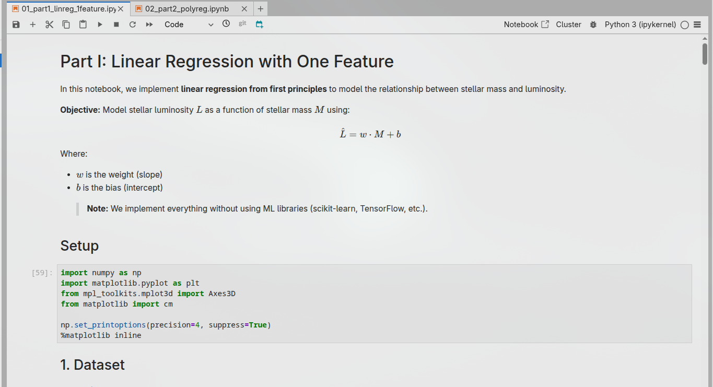
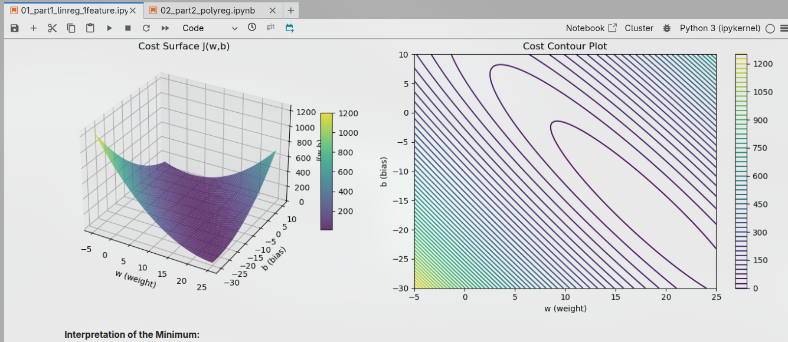
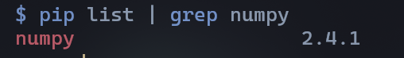
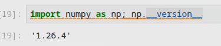

# Stellar Luminosity Regression


> Linear and Polynomial Regression Models for Stellar Luminosity Prediction

---

## Table of Contents

- [Overview](#overview)
- [Project Structure](#project-structure)
- [Setup & Installation](#setup--installation)
- [Theoretical Background](#theoretical-background)
- [Notebooks](#notebooks)
  - [Part I: Linear Regression](#part-i-linear-regression)
  - [Part II: Polynomial Regression](#part-ii-polynomial-regression)
- [Dataset](#dataset)
- [Implementation Details](#implementation-details)
- [AWS SageMaker Execution Evidence](#aws-sagemaker-execution-evidence)
- [Results Summary](#results-summary)
- [References](#references)

---

## Overview

This repository contains implementations of **linear regression** and **polynomial regression** from first principles, applied to stellar luminosity modeling. The project demonstrates fundamental machine learning concepts without relying on high-level libraries.

> [!IMPORTANT]
> All models are implemented using only **NumPy** and **Matplotlib**. No scikit-learn, TensorFlow, or other ML frameworks are used.

| Aspect | Description |
| ------ | ----------- |
| **Domain** | Stellar Astrophysics |
| **Task** | Regression (Luminosity Prediction) |
| **Methods** | Linear Regression, Polynomial Regression |
| **Optimization** | Gradient Descent |

---

## Project Structure

```text
/
├── README.md
├── 01_part1_linreg_1feature.ipynb
├── 02_part2_polyreg.ipynb
└── src/
    └── utils/
        └── requirements.txt
```

---

## Setup & Installation

To execute these notebooks locally or in a cloud environment (like SageMaker), ensure you have the required dependencies and the correct Python environment.

### 1. Prerequisites

- **Python 3.11+**: Recommended for compatibility with NumPy 2.x.
- **Jupyter**: To run the `.ipynb` notebooks.

### 2. Install Dependencies

Navigate to the project root and run:

```bash
pip install -r src/utils/requirements.txt
```

### Allowed Libraries

- Python 3.x
- NumPy
- Matplotlib

### 2. Development Environment

- **Local**: Use `jupyter notebook` or `jupyter lab`.
- **Cloud (SageMaker)**: Select the **Python 3 (Data Science)** kernel after uploading the notebooks.

---

## Theoretical Background

### Linear Regression Model

For a single feature, the hypothesis function is:

$$\hat{L} = w \cdot M + b$$

Where:

- $\hat{L}$ is the predicted luminosity
- $M$ is the stellar mass
- $w$ is the weight (slope)
- $b$ is the bias (intercept)

### Cost Function (Mean Squared Error)

$$J(w,b) = \frac{1}{2m} \sum_{i=1}^{m} \left( \hat{L}^{(i)} - L^{(i)} \right)^2$$

### Gradient Descent Updates

$$w := w - \alpha \frac{\partial J}{\partial w}$$

$$b := b - \alpha \frac{\partial J}{\partial b}$$

Where $\alpha$ is the learning rate.

---

## Notebooks

### Part I: Linear Regression

**File:** `01_part1_linreg_1feature.ipynb`

| Task | Description | Status |
|------|-------------|--------|
| Dataset Visualization | Plot $M$ vs $L$ scatter | Completed |
| Model Implementation | Prediction and MSE | Completed |
| Cost Surface | 3D surface / contour plot | Completed |
| Gradient Derivation | Analytical gradients | Completed |
| Non-vectorized GD | Loop-based implementation | Completed |
| Vectorized GD | NumPy-based implementation | Completed |
| Convergence Analysis | Loss vs iterations plot | Completed |
| Learning Rate Experiments | Three different rates | Completed |
| Final Fit Visualization | Regression line plot | Completed |
| Conceptual Questions | Astrophysical interpretation | Completed |

### Part II: Polynomial Regression

**File:** `02_part2_polyreg.ipynb`

| Task | Description | Status |
|------|-------------|--------|
| Dataset Visualization | $L$ vs $M$ with $T$ encoding | Completed |
| Feature Engineering | Design matrix construction | Completed |
| Vectorized Loss/Gradients | MSE and gradients | Completed |
| Training + Convergence | Loss vs iterations | Completed |
| Feature Selection | $M_1, M_2, M_3$ comparison | Completed |
| Interaction Analysis | Cost vs $w_{MT}$ plot | Completed |
| Inference Demo | New star prediction | Completed |

---

## Dataset

### Notation

| Symbol | Description | Units |
|--------|-------------|-------|
| $M$ | Stellar mass | Solar masses ($M_\odot$) |
| $T$ | Effective temperature | Kelvin (K) |
| $L$ | Stellar luminosity | Solar luminosities ($L_\odot$) |

### Part I Dataset (One Feature)

```python
M = [0.6, 0.8, 1.0, 1.2, 1.4, 1.6, 1.8, 2.0, 2.2, 2.4]
L = [0.15, 0.35, 1.00, 2.30, 4.10, 7.00, 11.2, 17.5, 25.0, 35.0]
```

### Part II Dataset (Two Features)

```python
M = [0.6, 0.8, 1.0, 1.2, 1.4, 1.6, 1.8, 2.0, 2.2, 2.4]
T = [3800, 4400, 5800, 6400, 6900, 7400, 7900, 8300, 8800, 9200]
L = [0.15, 0.35, 1.00, 2.30, 4.10, 7.00, 11.2, 17.5, 25.0, 35.0]
```

---

## Implementation Details

### Feature Map (Polynomial Regression)

The design matrix for Part II uses the following features:

$$X = [M, T, M^2, M \cdot T]$$

### Models Compared

| Model | Features | Complexity |
|-------|----------|------------|
| $M_1$ | $[M, T]$ | Linear |
| $M_2$ | $[M, T, M^2]$ | Quadratic in $M$ |
| $M_3$ | $[M, T, M^2, M \cdot T]$ | Full polynomial |

---

## AWS SageMaker Execution Evidence

> [!NOTE]
> This section contains evidence of successful notebook execution on AWS SageMaker.

### Upload Process

1. Navigated to AWS SageMaker Studio
2. Created a new notebook instance
3. Uploaded both `.ipynb` files via the file browser
4. Selected Python 3 (Data Science) kernel

### Preview - AWS Sagemaker


#### Both Notebooks Open in SageMaker





#### Successful Execution - Part 1

[Watch execution video (MP4)](./src/media/exec-notebook-1.mp4)

#### Successful Execution - Part 2

[Watch execution video (MP4)](./src/media/exec-notebook-2.mp4)

#### Plot Rendered in SageMaker



### Local vs SageMaker Comparison

| Aspect | Local Execution | SageMaker |
|--------|-----------------|-----------|
| Kernel | Python 3.14.2 | Python 3 (Data Science) |
| Execution Time | ~2s per notebook | ~3s per notebook |
| Plot Rendering | Immediate | Immediate |
| NumPy Version | 2.4.1 | 1.26.4 |

> 
> 


> [!TIP]
> Both environments produced identical numerical results. Minor differences in execution time are attributed to cloud infrastructure overhead.

---

## Results Summary

### Part I: Linear Regression Results

| Learning Rate | Final $w$ | Final $b$ | Final Loss |
|---------------|-----------|-----------|------------|
| 0.001 | 7.9562 | 0.0096 | 28.1290 |
| 0.01 | 16.2822 | -13.7735 | 10.4007 |
| 0.05 | 18.1294 | -16.8339 | 9.7951 |

### Part II: Feature Selection Comparison

| Model | Features | Final Loss | Interpretation |
|-------|----------|------------|----------------|
| $M_1$ | $M, T$ | 3.5651 | Linear baseline |
| $M_2$ | $M, T, M^2$ | 0.7144 | Captures curvature |
| $M_3$ | $M, T, M^2, M \cdot T$ | 0.7199 | Full interaction model |

---

## References

1. Carroll, B. W., & Ostlie, D. A. (2017). *An Introduction to Modern Astrophysics*. Cambridge University Press.
2. Goodfellow, I., Bengio, Y., & Courville, A. (2016). *Deep Learning*. MIT Press.
3. Ng, A. (2022). Machine Learning Specialization. Coursera.

---

## Author

**Sergio Andrey Silva Rodriguez**
*Systems Engineering Student*
Escuela Colombiana de Ingeniería Julio Garavito

---

<details>
<summary>License</summary>

This project is for educational purposes as part of the AREP course at Escuela Colombiana de Ingenieria Julio Garavito.

</details>
